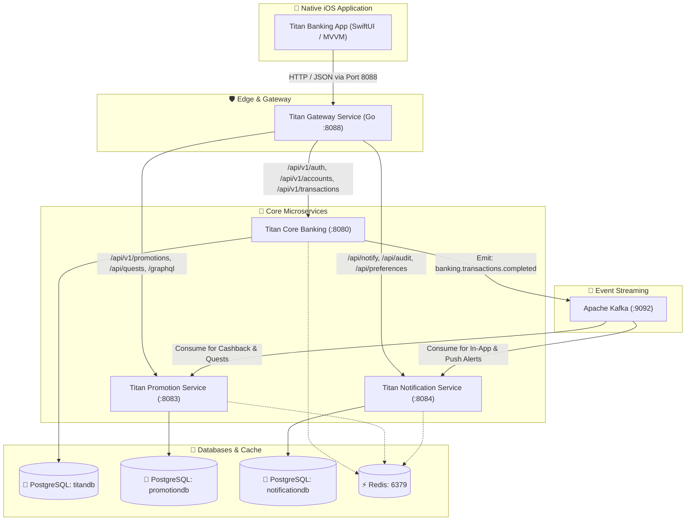

# Titan Banking Platform (Microservices API & Swift iOS)

Titan Banking is a modern, cloud-native banking platform engineered for high-throughput transactional reliability, event-driven ledger consistency, and seamless native mobile banking experiences.

The repository bundles the **core microservices backend** with the **native Swift iOS application**:

1. **Titan Gateway Service (`titan-gateway-go`)** — Reverse proxy, rate limiting, and unified entry point (:8088)
2. **Titan Core Service (`titan-core-banking`)** — Transaction ledger, accounts, auth, and transfers (:8080)
3. **Titan Promotion Service (`titan-promotions-service`)** — Real-time event-driven rewards and quests (:8083)
4. **Titan Notification Service (`titan-notifications-service`)** — Omni-channel alerts, APNs push, SMS, and email (:8084)
5. **Titan Banking iOS App (`Titan_Banking`)** — Native SwiftUI banking client for iPhone

---

## 🏛️ System Architecture



---

## 1. 🛡️ Titan Gateway Service (`titan-gateway-go`)

The API Gateway is a high-performance reverse proxy written in Go. It serves as the single unified entry point for mobile clients and external traffic, providing centralized routing, JWT verification, and DDoS protection.

* **Port**: `8088`
* **Language & Runtime**: Go (Golang)
* **Configuration**: `config.yaml`

### Key Features
* **Reverse Proxy**: Proxies requests to downstream microservices with header propagation (`X-Gateway`, `X-Real-IP`, `X-Forwarded-Host`).
* **Sliding Window Rate Limiter**: Configurable requests-per-window limit (default: 100 requests per 60s per IP) with automatic temporary IP blocking for violators.
* **JWT Authentication Guard**: Validates HMAC-SHA256 tokens before forwarding requests to protected endpoints.
* **Built-in Health Checks**: Live telemetry endpoint (`/health`) and real-time route discovery (`/routes`).

### Core Routes
| Route Pattern | Target Upstream | Access Type |
| :--- | :--- | :--- |
| `/api/v1/auth/**` | `titan-core-banking:8080` | Public |
| `/api/v1/accounts/**` | `titan-core-banking:8080` | JWT Protected |
| `/api/v1/transactions/**` | `titan-core-banking:8080` | JWT Protected |
| `/api/v1/qr/**` | `titan-core-banking:8080` | JWT Protected |
| `/api/v1/atm/**` | `titan-core-banking:8080` | JWT Protected |
| `/api/v1/promotions/**` | `titan-promotions-service:8083` | JWT Protected |
| `/api/notify/**` | `titan-notifications-service:8084` | JWT Protected |
| `/api/audit/**` | `titan-notifications-service:8084` | JWT Protected |
| `/api/preferences/**` | `titan-notifications-service:8084` | JWT Protected |
| `/health` | Gateway Internal | Public |

---

## 2. 🏦 Titan Core Service (`titan-core-banking`)

The central transactional heart of the banking platform. It manages user identities, bank accounts, balance ledgers, double-entry financial transfers, QR code operations, and ATM cardless withdrawals.

* **Port**: `8080`
* **Framework**: Java 21, Spring Boot, Spring Data JPA
* **Database**: PostgreSQL (`titandb`) with Flyway migrations
* **Messaging**: Kafka Producer (`banking.transactions.completed`, `banking.accounts.created`)
* **Configuration File**: `src/main/resources/application.properties`

### Key Responsibilities
* **User & Auth Management**: User registration, credential hashing, and JWT token issuance.
* **Account Ledger**: Multi-currency accounts (USD, KHR), balance tracking, and audit logging.
* **Transaction Engine**: Atomic deposits, withdrawals, transfers, and scheduled payments with idempotent processing.
* **QR Payment Module**: Dynamic & static QR code generation and instant payment settlement.
* **ATM Cardless Withdrawal**: Time-limited OTP codes for cardless cash withdrawal at ATMs.
* **Autonomous Operations**: CBDC bridge integration and Merkle ledger auditing.

### Key API Endpoints
* `POST /api/v1/auth/register` — Register a new bank customer.
* `POST /api/v1/auth/login` — Customer login & JWT issuance.
* `GET /api/v1/accounts` — Fetch accounts for the authenticated user.
* `POST /api/v1/transactions/transfer` — Execute peer-to-peer or internal transfer.
* `POST /api/v1/transactions/deposit` — Cash deposit to account.
* `POST /api/v1/transactions/withdraw` — Withdraw funds.
* `POST /api/v1/qr/generate` — Generate dynamic KHQR payment code.
* `POST /api/v1/atm/generate-code` — Create time-limited ATM withdrawal code.

---

## 3. 🎁 Titan Promotion Service (`titan-promotions-service`)

An event-driven gamification and cashback engine that evaluates marketing campaigns, merchant discounts, referral rewards, and deposit bonuses in real time.

* **Port**: `8083`
* **Framework**: Java, Spring Boot, Spring Data JPA, GraphQL
* **Database**: PostgreSQL with PostGIS (`promotiondb`)
* **Messaging**: Kafka Consumer (`banking.transactions.completed`), Producer (`banking.rewards.granted`)
* **Configuration File**: `src/main/resources/application.properties`

### Key Responsibilities
* **Real-Time Reward Evaluation**: Listens to transaction completion events on Kafka and grants rewards/cashback asynchronously.
* **Deposit Bonus Engine**: Automated bonus credit calculation for promotional campaigns.
* **Gamified Quests & Leaderboards**: User challenges, reward ladders, and GraphQL query interfaces.
* **Geospatial & Partner Merchant Triggers**: Location-aware merchant cashbacks using PostGIS.
* **Outbox Pattern & Distributed Locks**: Guaranteed at-least-once event delivery and concurrency defense.

### Key API Endpoints
* `GET /api/v1/promotions/active` — List active user promotions and campaigns.
* `POST /api/v1/promotions/deposit-bonus` — Calculate and claim deposit bonuses.
* `GET /api/quests` — Fetch active challenges and quest progress.
* `GET /api/referrals/my-code` — Retrieve user referral link and reward status.
* `POST /graphql` — Query leaderboard and promotion graphs.

---

## 4. 🔔 Titan Notification Service (`titan-notifications-service`)

An enterprise notification dispatcher supporting omni-channel messaging across iOS push notifications (APNs), SMS, Email, and in-app alert streams.

* **Port**: `8084`
* **Framework**: Java, Spring Boot, Spring Data JPA
* **Database**: PostgreSQL (`notificationdb`)
* **Messaging**: Kafka Consumer (`banking.transactions.completed`), DLQ Handler (`banking.notifications.dlq`)
* **Configuration File**: `src/main/resources/application.properties`

### Key Responsibilities
* **Kafka Transaction Listener**: Automatically consumes transaction events and triggers recipient alerts.
* **Direct HTTP Fallback**: Accepts direct notification triggers (`/api/notify/transaction`) when Kafka is disabled in lightweight environments.
* **Multi-Channel Dispatch**:
  - **In-App Alerts**: Stored in DB and polled or streamed to the iOS app.
  - **Apple APNs Push**: Simulator notification bridge and APNs delivery.
  - **SMS**: Twilio integration with secondary fallback strategies.
  - **Email**: SendGrid SMTP / API integration.
* **User Preferences & Audit**: Granular user toggles (SMS, Email, Push) and compliance audit history.

### Key API Endpoints
* `GET /api/audit/user/{userId}` — Retrieve notification history and delivery statuses.
* `GET /api/preferences/{userId}` — Get user channel notification preferences.
* `PUT /api/preferences/{userId}` — Update notification settings (enable/disable SMS, email, push).
* `POST /api/notify/send` — Trigger high-priority direct notification.

---

## 5. 📱 Titan Banking iOS App (`Titan_Banking`)

The mobile client is a native iOS application built with **SwiftUI** and **MVVM** architecture. It interacts exclusively with the backend via the **Titan Gateway (`localhost:8088`)**, ensuring end-to-end security and clean separation of concerns.

* **Path**: `Titan_Banking__Dev_Connect_with_server_machineMAC/`
* **Language & Framework**: Swift 5.9+, SwiftUI, Combine, Modern Concurrency (`async`/`await`)
* **Target OS**: iOS 16.0+ / iOS 17.0+
* **Networking**: Unified `APIClient` targeting `http://localhost:8088` (Gateway)

### Key Mobile Features
* **Authentication & Security**:
  - Secure login, customer registration, and JWT token storage in Keychain.
  - Biometric authentication (FaceID / TouchID) and optional PIN passcode lock.
* **Dashboard & Account Ledger**:
  - Dual-currency display (USD and KHR) with real-time balance eye-toggle.
  - Interactive account carousel card selector.
  - Quick action shortcuts (Transfer, QR Pay, Deposit, Withdraw).
* **Transfers & Payments**:
  - Peer-to-peer account transfers with live smart currency conversion.
  - Scheduled and recurring transfers.
  - International cross-border transfers.
* **KHQR (Bakong) Payments**:
  - Built-in camera QR scanner and photo library picker.
  - Dynamic QR code generation (embedded amount and account details).
  - One-tap instant payment settlement.
* **Cardless ATM Cash Out**:
  - Generate time-limited 6-digit ATM withdrawal OTP codes.
  - Built-in ATM redemption simulator for testing withdrawals without a physical machine.
* **Fixed Deposit & Wealth Management**:
  - Interactive tenure selector (3, 6, 12 months) with real-time interest return calculator.
  - Direct account opening and tracking.
* **e-Statements**:
  - Monthly financial account statement generation and PDF preview/download.
* **Real-Time Notification Banner**:
  - Global background polling showing floating in-app transaction banners within seconds of funds arrival.
  - Notification history feed and delivery channel preferences (Push, SMS, Email).

---

## ⚙️ Environment Variables Reference

| Category | Environment Variable | Affected Services | Default / Example |
| :--- | :--- | :--- | :--- |
| **Database** | `DB_HOST` | Core, Promo, Notif | `localhost` (Docker: `postgres`) |
| | `DB_PORT` | Core, Promo, Notif | `5432` |
| | `DB_USERNAME` | Core, Promo, Notif | `postgres` |
| | `DB_PASSWORD` | Core, Promo, Notif | `TitanDB$ecure2026_X9z!Lp` |
| | `SPRING_DATASOURCE_URL` | Core, Promo, Notif | `jdbc:postgresql://<host>:5432/<dbname>` |
| **Kafka** | `KAFKA_BOOTSTRAP_SERVERS` | Core, Promo, Notif | `localhost:9092` (Docker: `kafka:29092`) |
| | `KAFKA_ENABLED` | Notif, Core | `true` (Docker) / `false` (Local fallback) |
| **Redis** | `REDIS_HOST` | Core, Promo, Notif | `localhost` (Docker: `redis`) |
| | `REDIS_PORT` | Core, Promo, Notif | `6379` |
| **Security** | `JWT_SECRET` | Gateway, Core, iOS | Shared HMAC-256 256-bit secret string |
| **Services** | `NOTIFICATION_SERVICE_URL` | Core Banking | `http://localhost:8084` |
| | `PROMOTION_SERVICE_URL` | Core Banking | `http://localhost:8083` |
| | `CONFIG_PATH` | Gateway | `/app/config.yaml` |

---

## 🚀 Quick Start Guide

### 1. Start Backend Microservices with Docker
From the project backend directory:

```bash
cd Titan_Project

# Start infrastructure (PostgreSQL, Kafka, Redis) and core microservices
docker compose up -d --build postgres redis kafka kafka-init titan-core-banking titan-promotions-service titan-notifications-service titan-gateway-go

# Verify all containers are healthy
docker compose ps
```

The gateway is now listening on **`http://localhost:8088`**.

### 2. Run the iOS Application
1. Open Xcode:
   ```bash
   open Titan_Banking__Dev_Connect_with_server_machineMAC/Titan_Banking.xcodeproj
   ```
2. Select an iOS Simulator (e.g. **iPhone 15 Pro** or **iPhone 16 Pro**).
3. Press **`Cmd + R`** to build and run.
4. The app automatically connects to `http://localhost:8088` through the Go Gateway.
