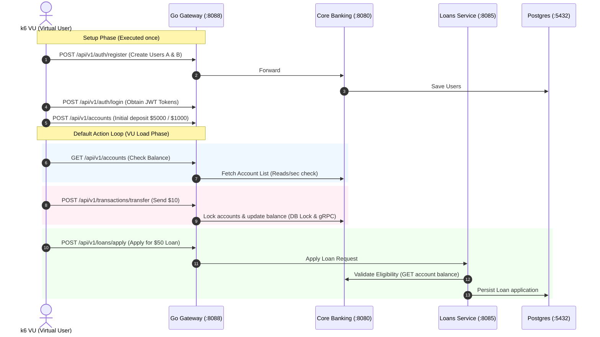

# ⚡ Titan Banking Load Testing Workflow (k6)

This directory contains a **k6** performance load testing suite designed to stress-test the Titan Banking ecosystem. It simulates real-world transaction actions through the **Go API Gateway**, stressing the downstream **Java Spring Boot microservices** (Core Banking & Loans Service).

---

## 🎯 Testing Workflow Map

The script executes the following end-to-end user actions under concurrent load:



---

## 🛠️ Getting Started

### 1. Install k6
Ensure **k6** is installed on your Mac:
```bash
brew install k6
```

### 2. Run the Load Test
Execute the script using `k6`. The test will run with virtual users ramping up from 0 to 10 over 30 seconds:

```bash
k6 run performance_test.js
```

---

## 📈 Analyzing Java Code & JVM Performance

When running this test, monitor the terminal/IDE logs of your Java services. Keep an eye on:

### 1. Database Locking & Latency (`p(95)` limits)
* In **Core Banking** logs, verify that the transaction transfers execute without lock timeout exceptions. The `@Transactional` method handles locking lexicographically (using `SELECT FOR UPDATE`) to prevent deadlocks under high concurrency.
* Check the custom metric `transaction_processing_latency` in your k6 report. If it exceeds 200ms, it indicates Postgres lock contention or JVM thread pool starvation.

### 2. Spring Boot Thread Pools & Hikari Connection Pools
* Look for Hikari CP logs:
  `HikariPool-1 - Connection active: 8, idle: 2, waiting: 0`
  If connection pool leakage or starvation occurs, requests will queue, and k6 latencies will spike.

### 3. JVM Garbage Collection (GC) Activity
* Since we are stressing the endpoints, watch the JVM GC events. You can enable GC logging on your JVM to see if the Garbage Collector causes "Stop the World" pauses:
  ```bash
  # Run JVM with GC logging enabled
  java -XX:+UseG1GC -Xlog:gc* -jar your-app.jar
  ```
* High GC pause times will directly reflect as latency outliers in k6's `http_req_duration` reports.

### 4. gRPC Inter-Service Communication
* Every loan application triggers a gRPC call from `loans-service` to `core-banking` for account validation. High latencies in `loan_processing_latency` can suggest gRPC channel initialization overheads or network bottlenecks.
